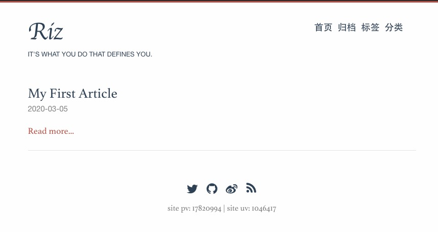

# Riz
A Hugo theme based on hugo-theme-even

# Quick Start 

## 1. Install Hugo 
- see: https://gohugo.io/getting-started/installing/
## 2. Create New Site
```
hugo new site mysite

cd mysite
```
## 3. Config Riz Theme
```
git submodule add https://github.com/ktlshya/riz.git themes/riz

mv themes/riz/config/config.toml ./
```

## 4. Post Your First Article
```
hugo new post/my-first-article.md
```

## 5. Start hugo Server
```
hugo server -D
```

Now access http://localhost:1313 with your browser.


